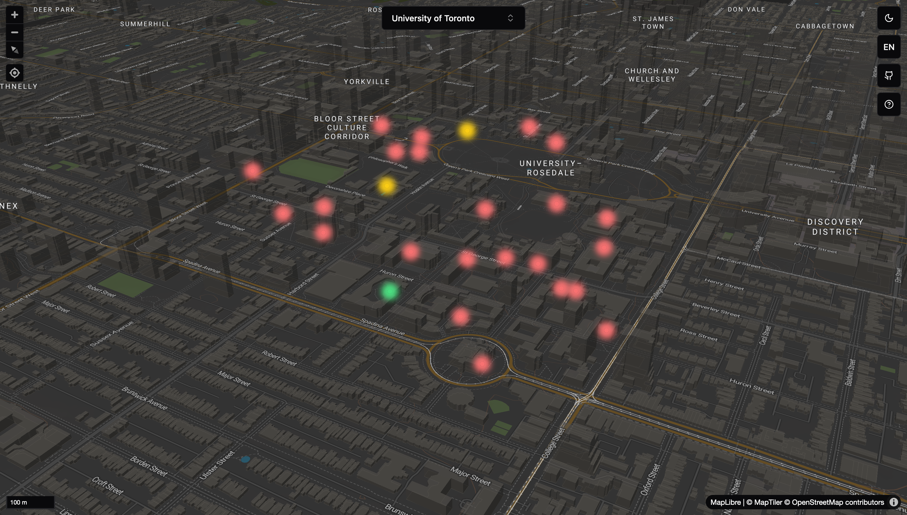

# Study Spots

Find study spots on- and off-campus quickly!

Thank you to the open-source community for making this project possible[^1] [^2]
[^3] [^4].

## Contributions

I welcome all contributions for more student spaces. All of the data is stored
in the [`src/data`](./src/data/) folder. Thank you in advance.

## Technologies Used

This project leverages several modern technologies to provide a seamless and
dynamic user experience:

- **Svelte 5**: Core framework used to build the application, ensuring fast and
  reactive interfaces;
- **Runes**: Extends Svelte with additional capabilities for state and logic
  management;
- **ShadCN**: Provides pre-built, customizable UI components for a polished user
  interface;
- **[AnyOrigin](https://api.allorigins.win)**: To bypass CORS errors in the
  browser because the site has no backend (to save costs);
- **MapLibre** and **MapTiler**: Used for rendering interactive maps and
  managing map data; and
- **Tailwind CSS**: Enables rapid and consistent styling with a utility-first
  CSS framework.

## Future Enhancements

Looking ahead, I can introduce the following features to further enhance the
functionality of the application:

- **Google Maps API Integration**: Utilize the Google Maps API to dynamically
  fetch and display time and location-specific data, ensuring up-to-date and
  accurate information; and
- **User Notifications**: Allow users to select specific locations and receive
  notifications about their opening or closing times, enhancing the utility of
  the platform.

## References

Thanks to both of these similar projects for providing insights on locations for
other campuses:

- https://spots.aksharbarot.com/; and
- https://www.uoftatlas.com/.

## Screenshots

[^1]:
    Favicon resourced from
    [Freepik - Flaticon](https://www.flaticon.com/free-icons/study)

[^2]: UI library from [Shadcn](https://www.shadcn-svelte.com/)

[^3]: Map features from [Maplibre](https://maplibre.org/)

[^4]: Icons from [Lucide Icons](https://lucide.dev/)
